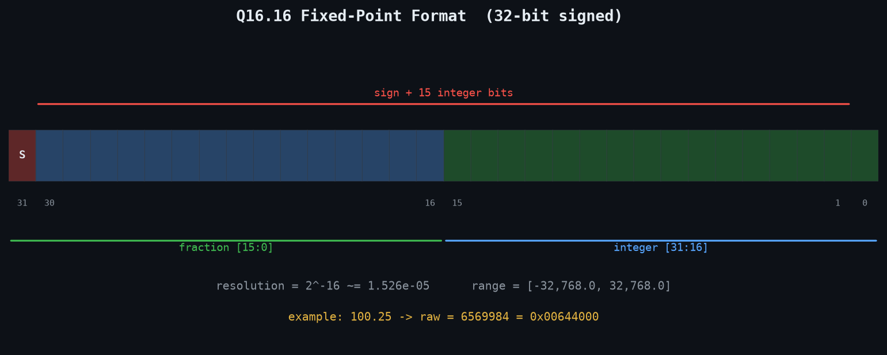
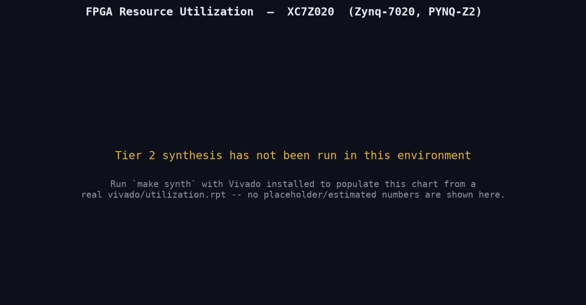
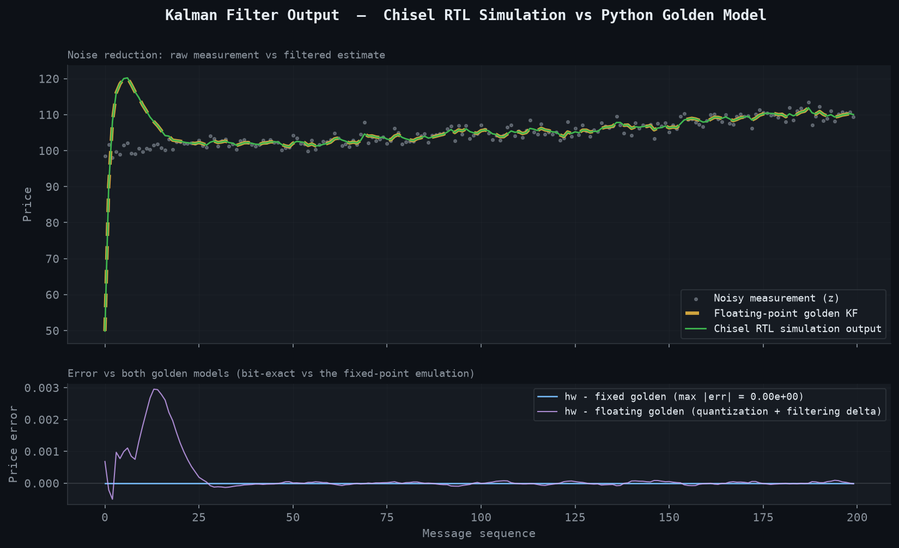

# Fixed-Point Kalman Filter FPGA (Chisel)

A fixed-point Kalman filter for HFT mid-price estimation, built entirely in RTL — no HLS. It's designed as a downstream signal-smoothing stage for the [fpga-crypto-feed-handler](../../EE%20Hardware/fpga-crypto-feed-handler) order book: take its noisy `midprice` output and produce a smoothed price estimate plus a live drift (momentum) estimate, in hardware, with no software in the loop.

Where the order book project is a stream-processing design (single-cycle updates, always-ready AXI-Stream), this project is deliberately different: a **recursive, loop-carried** filter built around real pipelined matrix-multiply hardware and a division-free Newton-Raphson reciprocal — the two pieces of arithmetic hardware most FPGA "Kalman filter" toy examples skip by assuming a precomputed steady-state gain.

---

## Concept & Purpose

Order books report the current best bid/ask, but that midprice is noisy tick-to-tick. A Kalman filter is the standard way to extract a smoother "true price" estimate and a momentum (drift) signal from that noise — used throughout HFT for signal smoothing ahead of a trading decision.

This implementation focuses on:
- A **real 2x2 matrix-multiply pipeline**, not a hand-simplified scalar shortcut — used for the F·P·Fᵀ covariance-predict step, the one place in this filter where genuine matrix arithmetic is unavoidable
- A **pipelined Newton-Raphson reciprocal**, avoiding any hardware divider for the Kalman gain
- **Bit-exact verification** against a Python fixed-point emulation of the identical algorithm, not just floating-point tolerance matching
- Runtime-configurable filter tuning (`dt`, process noise, measurement noise) via an input port, not baked into the netlist as constants

## Project Status

**Scope of this build: Tier 1 (simulation) + Tier 2 (synthesis), in Chisel.**

✔ Q16.16 fixed-point primitives: pipelined multiplier (round-half-up, saturating), saturating add
✔ Pipelined 2x2 fixed-point matrix multiply, tested against dense arbitrary matrices
✔ Pipelined Newton-Raphson reciprocal (no hardware divider), swept 0.01–1000
✔ Top-level structural (FSM-free) predict → innovate → reciprocal → gain → update pipeline
✔ ChiselTest suite: 24 cases across all submodules + the full filter
✔ Python golden model: floating-point reference + bit-exact Q16.16 emulation of the RTL algorithm
✔ End-to-end replay: 200/200 rows bit-exact match between RTL simulation and the golden model
✔ Out-of-context Vivado synthesis script (`tcl/kalman_synth.tcl`) targeting the same XC7Z020 part as the sibling repo

**Not yet built** (see [Roadmap](#roadmap)): on-hardware PYNQ-Z2 integration, and the SystemVerilog / SpinalHDL / Amaranth ports.

---

## Architecture Overview

```
KalmanMeasurement (z, seqNum)                    KalmanConfig (dt, q0, q1, r)
        │                                                  │
        ▼                                                  ▼
┌───────────────────────────────────────────────────────────────────┐
│                          KalmanFilter                              │
│                                                                      │
│  predict x:  x_pred0 = x0 + dt*x1     (F sparse: scaled-add, not   │
│              x_pred1 = x1              a real matmul)              │
│                                                                      │
│  predict P:  F·P            ┐                                      │
│              (F·P)·Fᵀ + Q   ┴─  2x chained Matrix2x2FixedMul       │
│                                  (the real matrix-multiply hardware)│
│                                                                      │
│  innovate:   y = z - x_pred0          S = P_pred00 + R             │
│                                                                      │
│  reciprocal: invS = 1/S               ┴─  Newton-Raphson,          │
│                                            no hardware divider      │
│                                                                      │
│  gain:       K0 = P_pred00*invS       K1 = P_pred01*invS           │
│                                                                      │
│  update:     x_new = x_pred + K*y                                  │
│              P_new = P_pred - K·(row0 of P_pred)                   │
│                                                                      │
└──────────────────────────────┬──────────────────────────────────────┘
                                │  KalmanEstimate (price, drift, seqNum)
                                ▼
                    [future: order book integration]
```

<p align="center">
  
</p>

The filter tracks a 2-state model, `x = [price, drift]ᵀ`, with state transition `F = [[1, dt], [0, 1]]` and measurement matrix `H = [1, 0]` (the order book reports price directly, not drift). Because `H` is a trivial selector, the measurement-side math (`H·x`, `H·P·Hᵀ`) never needs real matrix multiply hardware — but `F·P·Fᵀ` in the covariance-predict step does, and that's implemented as a genuinely reusable `Matrix2x2FixedMul` block, tested independently against dense arbitrary matrices (not just the sparse `F` it happens to be fed at the KalmanFilter call site).

`dt` is deliberately a **runtime config input**, not a Scala constant folded into `F` at elaboration time — otherwise Vivado could algebraically simplify the "matrix multiply" down to something trivial, defeating the point of demonstrating real pipelined multiply hardware.

---

## Why a Structural Pipeline, Not an FSM?

`KalmanFilter.scala` has no state machine. Every submodule (`FixedPointMul`, `Matrix2x2FixedMul`, `Reciprocal`) is a plain combinational-plus-register pipeline with no internal control state. The filter's persistent state (`x0, x1, P00, P01, P11`) and per-request latched inputs are held constant for an entire request — nothing else can write them until the pipeline finishes — so each submodule, fed constant inputs, settles into a steady-state output that remains correct indefinitely after its first `valid` pulse.

That means downstream stages never need `ShiftRegister` realignment against upstream latency: they just read the upstream *data* wire directly, gated on whichever dependency's `valid` pulse arrives last. A single `busy` register handles backpressure (`Decoupled` input), since the recursive state dependency (predict₍ₖ₊₁₎ needs the fully-updated x_k/P_k) means a new measurement genuinely can't be accepted mid-pipeline — unlike the order book, which is stateless per message and always-ready.

---

## Performance

| Metric | Value |
|---|---|
| Clock target | 250 MHz (4 ns period), matching the sibling repo |
| Pipeline latency | ~27 cycles per accepted measurement (~108 ns) |
| Long pole | the Newton-Raphson reciprocal (~17 of the 27 cycles) |
| Throughput | 1 measurement per ~27 cycles (loop-carried, not II=1) |
| Target device | Zynq XC7Z020 (PYNQ-Z2), out-of-context synthesis |

~108 ns per update is far faster than realistic order-book update rates, so the lack of II=1 throughput is a non-issue in practice.

<p align="center">
  
</p>

Vivado isn't installed in the environment this was built in, so `tcl/kalman_synth.tcl` has not yet been run for real — the utilization chart above is an explicit "pending synthesis" placeholder, not a fabricated estimate. Run `make synth` with Vivado available to populate it from a real `vivado/utilization.rpt`.

---

## Signal Output vs. Golden Model

<p align="center">
  
</p>

Both panels use **real, verified vectors** from `make sim` — not synthetic placeholder data. The top panel overlays a noisy synthetic price series against the floating-point golden filter and the actual Chisel RTL simulation output; the bottom panel shows the RTL is bit-exact against the fixed-point golden model (flat line at zero) and has only a small quantization delta against the floating-point reference.

---

## Verification Strategy

Three levels, mirroring the sibling repo's approach but tightened to bit-exact matching rather than floating-point tolerance:

1. **ChiselTest, per submodule** — `FixedPointMul` (rounding/saturation/pipelining), `Matrix2x2FixedMul` (dense arbitrary matrices, not just the sparse `F` use case), `Reciprocal` (swept 0.01–1000), and the top-level `KalmanFilter` (convergence, backpressure correctness, seqNum passthrough) — 24 cases, all passing.
2. **Golden-model self-check** — `test_kalman_golden.py` validates the Python fixed-point emulation (`fixed_mul`, `reciprocal_fixed`, `KalmanFilterFixedRef`) against the floating-point reference *before* trusting it as the hardware checker — 27 cases, all passing.
3. **End-to-end bit-exact diff** — `KalmanFilterReplayTest.scala` drives the DUT through a 200-point synthetic measurement series via the real `Decoupled` handshake; `diff_kalman.py` then diffs the hardware output against the fixed-point golden model row-for-row. Result: **200/200 rows match exactly**, confirming the RTL implements the identical Q16.16 algorithm, not just "close enough" agreement.

One genuinely useful bug this caught: a directed convergence test initially looked like a hardware bug (price overshooting to ~108 instead of converging to 100 after 15 iterations of a repeated step input). Cross-checking against a NumPy floating-point reference of the identical recursion showed the *exact same* transient — confirming it was real filter behavior (P0's off-diagonal coupling between price and drift) rather than an RTL bug, and the test's tolerance was simply unrealistic for that parameter choice.

---

## Core Components

| File | Purpose |
|---|---|
| `chisel/src/main/scala/kalman/FixedPoint.scala` | Q16.16 primitives: `FixedPointMul` (2-cycle pipelined multiplier, round-half-up, saturating), `satAdd` |
| `chisel/src/main/scala/kalman/MatrixOps.scala` | `Matrix2x2` bundle + `Matrix2x2FixedMul` (3-cycle pipelined 2x2 matrix multiply) |
| `chisel/src/main/scala/kalman/Reciprocal.scala` | Pipelined Newton-Raphson `1/x` (normalize → minimax seed → 3 NR iterations → denormalize) |
| `chisel/src/main/scala/kalman/Types.scala` | `KalmanMeasurement`, `KalmanEstimate`, `KalmanConfig` I/O bundles |
| `chisel/src/main/scala/kalman/KalmanFilter.scala` | Top-level structural predict/innovate/gain/update pipeline |
| `golden/kalman_ref.py` | `KalmanFilterRef` (floating-point) + `KalmanFilterFixedRef` (bit-exact Q16.16 emulation) |
| `golden/diff_kalman.py` | Bit-exact hardware-vs-golden CSV diff |
| `tcl/kalman_synth.tcl` | Out-of-context Vivado synth + place + route, targeting XC7Z020 @ 250 MHz |
| `docs/gen_visuals.py` | Generates the three README figures from real verified vectors |

---

## Getting Started

**Prerequisites:** JDK, [sbt](https://www.scala-sbt.org/) (installed via `brew install sbt` if not present), Python 3 with a venv (`python3 -m venv .venv && .venv/bin/pip install -r golden/requirements.txt`). Vivado is optional, only needed for `make synth`.

```bash
# Tier 1: simulation (chisel tests + golden model + bit-exact replay diff)
make sim

# Tier 2: synthesis (requires Vivado)
make synth

# Regenerate README visuals from the latest vectors/synth output
make kf-visuals
```

Individual targets: `make kf-test` (ChiselTest only), `make kf-golden` (regenerate synthetic vectors), `make kf-test-replay` (RTL replay against golden), `make kf-golden-test` (pytest + diff), `make kf-verilog` (emit Verilog only).

---

## Roadmap

- **Tier 3: PYNQ-Z2 on-hardware integration** — wire `KalmanFilter` downstream of the order book's `BookSnapshot.midprice` (needs a tick→Q16.16 adapter, since the order book's prices are plain integer ticks) and bring up a live driver, following the sibling repo's Tier 3 pattern.
- **SystemVerilog, SpinalHDL, and Amaranth ports** — this Chisel implementation is the first of four planned HDL implementations of the same design, to compare ergonomics, resource usage, and generated RTL quality across languages.

---

## Repository Structure

```
kalman-filter/
  chisel/
    build.sbt, project/
    src/main/scala/kalman/     FixedPoint, MatrixOps, Reciprocal, Types, KalmanFilter
    src/test/scala/kalman/     unit + integration ChiselTest suites
  golden/
    kalman_ref.py               floating-point + bit-exact fixed-point golden models
    test_kalman_golden.py       validates the golden model itself
    diff_kalman.py               bit-exact hardware-vs-golden diff
  vectors/                       generated CSVs (gitignored, regenerate via `make kf-golden`)
  tcl/kalman_synth.tcl           out-of-context Vivado synthesis
  constraints/kalman_clock.xdc
  docs/
    gen_visuals.py
    previews/                    fixed_point_format.png, signal_overlay.png, utilization.png
  Makefile
```

---

## License

MIT — see [LICENSE](LICENSE).
