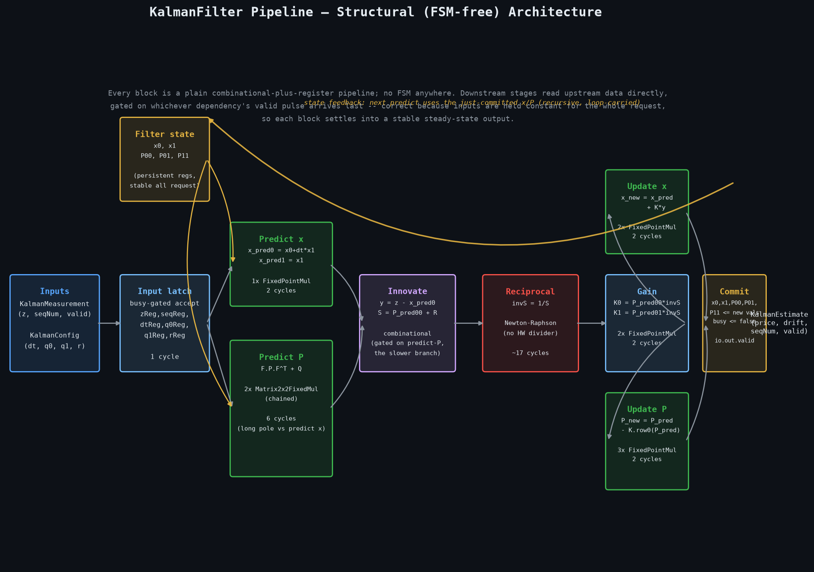
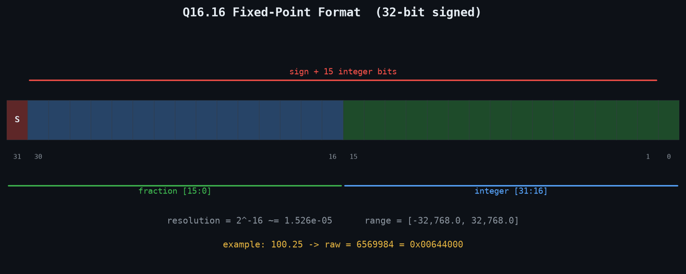
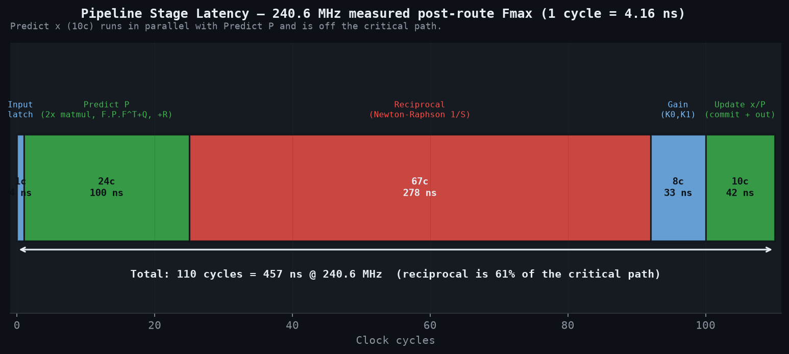
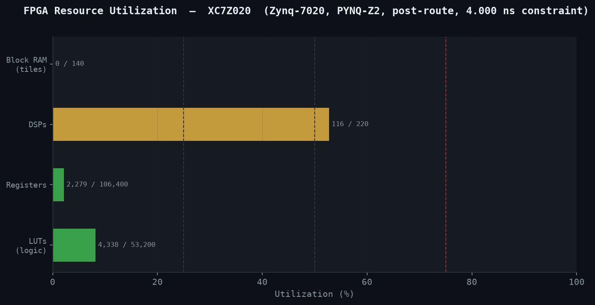
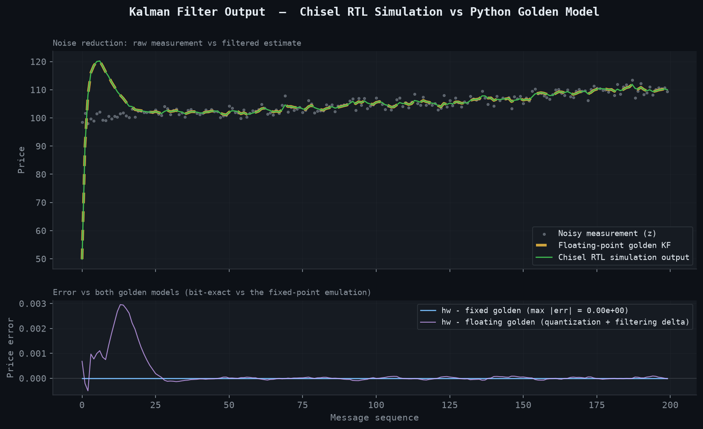
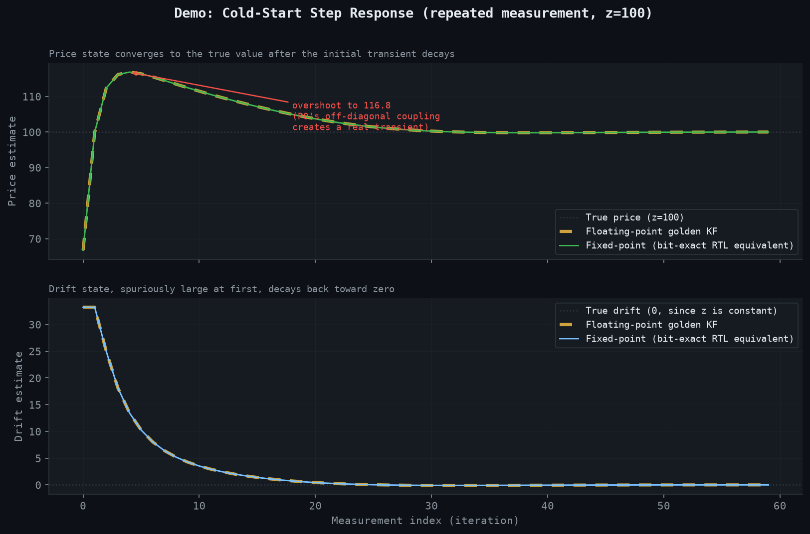

# Fixed-Point Kalman Filter FPGA (Chisel)

[](LICENSE)

A fixed-point Kalman filter for HFT mid-price estimation, built entirely in RTL — no HLS. It's designed as a downstream signal-smoothing stage for the [fpga-crypto-feed-handler](../../EE%20Hardware/fpga-crypto-feed-handler) order book: take its noisy `midprice` output and produce a smoothed price estimate plus a live drift (momentum) estimate, in hardware, with no software in the loop.

Where the order book project is a stream-processing design (single-cycle updates, always-ready AXI-Stream), this project is deliberately different: a **recursive, loop-carried** filter built around real pipelined matrix-multiply hardware and a division-free Newton-Raphson reciprocal — the two pieces of arithmetic hardware most FPGA "Kalman filter" toy examples skip by assuming a precomputed steady-state gain.

---

## Concept & Purpose

Order books report the current best bid/ask, but that midprice is noisy tick-to-tick. A Kalman filter is the standard way to extract a smoother "true price" estimate and a momentum (drift) signal from that noise — used throughout HFT for signal smoothing ahead of a trading decision.

This implementation focuses on:
- A **real 2x2 matrix-multiply pipeline**, not a hand-simplified scalar shortcut — used for the F·P·Fᵀ covariance-predict step, the one place in this filter where genuine matrix arithmetic is unavoidable
- A **pipelined Newton-Raphson reciprocal**, avoiding any hardware divider for the Kalman gain
- **Bit-exact verification** against a Python fixed-point emulation of the identical algorithm, not just floating-point tolerance matching
- Runtime-configurable filter tuning (`dt`, process noise, measurement noise) via an input port, not baked into the netlist as constants

## Project Status

**Scope of this build: Tier 1 (simulation) + Tier 2 (synthesis), in Chisel.**

✔ Q16.16 fixed-point primitives: pipelined multiplier (round-half-up, saturating), saturating add
✔ Pipelined 2x2 fixed-point matrix multiply, tested against dense arbitrary matrices
✔ Pipelined Newton-Raphson reciprocal (no hardware divider), swept 0.01–1000
✔ Top-level structural (FSM-free) predict → innovate → reciprocal → gain → update pipeline
✔ ChiselTest suite: 25 cases across all submodules + the full filter (including an exact-latency check against the `KalmanFilter.latency()` bookkeeping constant)
✔ Python golden model: floating-point reference + bit-exact Q16.16 emulation of the RTL algorithm
✔ End-to-end replay: 200/200 rows bit-exact match between RTL simulation and the golden model
✔ Out-of-context Vivado 2024.1 synthesis + place & route (`tcl/kalman_synth.tcl`) on the same XC7Z020 part as the sibling repo, with the post-route reports committed under [reports/](reports). As first written the design ran at 57 MHz; after re-pipelining the multiplier, the saturating adders and the reciprocal's shifters it reaches a setup-limited **240.6 MHz at the 4.000 ns constraint, 0.156 ns short of closing 250 MHz** (see [Synthesis results](#synthesis-results--post-route-timing-and-utilization))

**Not yet built** (see [Roadmap](#roadmap)): on-hardware PYNQ-Z2 integration, and the SystemVerilog / SpinalHDL / Amaranth ports.

---

## The Math: What This Circuit Actually Computes

A Kalman filter tracks a 2-vector state `x = [price, drift]ᵀ` and its uncertainty (a 2x2 covariance matrix `P`) through a **predict → measure → update** cycle, run once per incoming price observation:

```
State-transition model:      Measurement model:
x_k = F x_(k-1) + w          z_k = H x_(k-1) + v
F = [[1, dt], [0, 1]]        H = [1, 0]
w ~ N(0, Q)                  v ~ N(0, R)
```

`F` says "next price = current price + dt·drift, next drift = current drift" (a constant-velocity model). `H = [1, 0]` says "we only ever observe price directly, never drift" — the order book reports a midprice, not a rate of change.

Each cycle runs five equations:

```
predict:   x_pred = F x                    P_pred = F P Fᵀ + Q
innovate:  y = z - H x_pred                S = H P_pred Hᵀ + R
gain:      K = P_pred Hᵀ S⁻¹
update:    x = x_pred + K y                P = (I - K H) P_pred
```

Two things make this tractable in fixed-point RTL without a full linear-algebra library:

- **`H` is a trivial selector.** Since `H = [1, 0]`, `H x_pred` is just `x_pred`'s first element and `H P_pred Hᵀ` is just `P_pred`'s `(0,0)` entry — no real matrix-vector product needed on the measurement side. This collapses the general matrix-inverse `S⁻¹` (normally the expensive part of a Kalman filter) down to a **single scalar reciprocal**.
- **`F` is sparse, but `F P Fᵀ` isn't.** The `x`-side predict (`F x`) is cheap (one multiply-add), but running `P` — a real, dense-after-multiplication 2x2 matrix — through `F P Fᵀ` is exactly the kind of matrix arithmetic worth building real pipelined hardware for, and is the one piece of this filter that unambiguously needs it.

---

## Architecture Overview

```
KalmanMeasurement (z, seqNum)                    KalmanConfig (dt, q0, q1, r)
        │                                                  │
        ▼                                                  ▼
┌───────────────────────────────────────────────────────────────────┐
│                          KalmanFilter                              │
│                                                                      │
│  predict x:  x_pred0 = x0 + dt*x1     (F sparse: scaled-add, not   │
│              x_pred1 = x1              a real matmul)              │
│                                                                      │
│  predict P:  F·P            ┐                                      │
│              (F·P)·Fᵀ + Q   ┴─  2x chained Matrix2x2FixedMul       │
│                                  (the real matrix-multiply hardware)│
│                                                                      │
│  innovate:   y = z - x_pred0          S = P_pred00 + R             │
│                                                                      │
│  reciprocal: invS = 1/S               ┴─  Newton-Raphson,          │
│                                            no hardware divider      │
│                                                                      │
│  gain:       K0 = P_pred00*invS       K1 = P_pred01*invS           │
│                                                                      │
│  update:     x_new = x_pred + K*y                                  │
│              P_new = P_pred - K·(row0 of P_pred)                   │
│                                                                      │
└──────────────────────────────┬──────────────────────────────────────┘
                                │  KalmanEstimate (price, drift, seqNum)
                                ▼
                    [future: order book integration]
```

For the actual wiring — which submodule computes what, how the state-feedback loop closes, and how many cycles each stage takes — see the detailed block diagram:

<p align="center">
  
</p>

The filter tracks a 2-state model, `x = [price, drift]ᵀ`, with state transition `F = [[1, dt], [0, 1]]` and measurement matrix `H = [1, 0]`. Because `H` is a trivial selector, the measurement-side math (`H·x`, `H·P·Hᵀ`) never needs real matrix multiply hardware — but `F·P·Fᵀ` in the covariance-predict step does, and that's implemented as a genuinely reusable `Matrix2x2FixedMul` block, tested independently against dense arbitrary matrices (not just the sparse `F` it happens to be fed at the KalmanFilter call site).

`dt` is deliberately a **runtime config input**, not a Scala constant folded into `F` at elaboration time — otherwise Vivado could algebraically simplify the "matrix multiply" down to something trivial, defeating the point of demonstrating real pipelined multiply hardware.

### Fixed-point representation

<p align="center">
  
</p>

Every signal in the filter — state, covariance, gains, the reciprocal — is Q16.16: a 32-bit signed integer where the top 16 bits are the integer part (including sign) and the bottom 16 bits are the fraction, giving a resolution of `2⁻¹⁶ ≈ 1.5×10⁻⁵` over a range of roughly `±32,768`. Every multiply (`FixedPointMul`) produces a full 64-bit intermediate product, rounds half-up at the bit-15 boundary, and saturates to the 32-bit range rather than wrapping — the same discipline `satAdd` applies to every addition. This rounding/saturation behavior is replicated bit-for-bit in the Python golden model (`golden/kalman_ref.py`'s `fixed_mul`/`sat_add`), which is what makes the bit-exact hardware/golden diff possible.

### Why a division-free reciprocal?

Hardware division is expensive — there's no single-cycle divider primitive on a 7-series FPGA the way there's a DSP48 multiplier. Because `H` collapses the Kalman gain's matrix inverse down to a scalar reciprocal `1/S`, this filter only ever needs **one** division per cycle, and `Reciprocal.scala` computes it with three steps instead of a divider: locate the input's highest set bit and shift it to bit 15 (normalizing into `[0.5, 1.0)`), seed an initial guess with the standard minimax linear approximation `y₀ = 48/17 − 32/17·m`, then run 3 rounds of Newton-Raphson (`y_{n+1} = y_n·(2 − m·y_n)`), each of which roughly doubles the number of correct bits. Denormalize by rescaling with the same shift computed in step one. No divider, no lookup ROM beyond two constants.

---

## Why a Structural Pipeline, Not an FSM?

`KalmanFilter.scala` has no state machine. Every submodule (`FixedPointMul`, `Matrix2x2FixedMul`, `Reciprocal`) is a plain combinational-plus-register pipeline with no internal control state. The filter's persistent state (`x0, x1, P00, P01, P11`) and per-request latched inputs are held constant for an entire request — nothing else can write them until the pipeline finishes — so each submodule, fed constant inputs, settles into a steady-state output that remains correct indefinitely after its first `valid` pulse.

That means downstream stages never need `ShiftRegister` realignment against upstream latency: they just read the upstream *data* directly, gated on whichever dependency's `valid` pulse arrives last. The one rule this imposes is that a `valid` pulse must never overtake the data it announces, so every pipeline register added on a data path (the registered `xPred0`, `yInnov`, `P_pred` and `S` intermediates, the multiplier's operand registers) is matched by a register on the `valid` path that gates its consumer; `KalmanFilter.latency()` adds up exactly those stages, and a test checks the RTL against it. A single `busy` register handles backpressure (`Decoupled` input), since the recursive state dependency (predict₍ₖ₊₁₎ needs the fully-updated x_k/P_k) means a new measurement genuinely can't be accepted mid-pipeline — unlike the order book, which is stateless per message and always-ready.

---

## Performance

| Metric | Value |
|---|---|
| Clock constraint | 250 MHz (4.000 ns period), matching the sibling repo — **not met**: WNS -0.156 ns, 9 of 14954 endpoints failing |
| Achieved clock (post-route, setup-limited) | **240.6 MHz** at the 4.000 ns constraint; 245.4 MHz at 3.000 ns. Before re-pipelining: 57.1 MHz |
| Pipeline latency | 110 cycles per accepted measurement (≈ 457 ns at 240.6 MHz), up from 27 cycles at 57 MHz (≈ 473 ns): the pipelined design finishes an update sooner in wall-clock time |
| Long pole (cycles) | the Newton-Raphson reciprocal (67 of the 110 cycles) |
| Long pole (timing) | 4.103 ns, 4 logic levels, 3.151 ns of it routing: `reciprocal/shiftAmtCopiesN0_3_reg[0]` → `reciprocal/normPairN1_left_reg[29]` |
| Throughput | 1 measurement per 110 cycles (loop-carried, not II=1) |
| Target device | Zynq XC7Z020 (PYNQ-Z2), out-of-context synthesis + place & route |

≈ 457 ns per update is far faster than realistic order-book update rates, so the lack of II=1 throughput is a non-issue in practice; how close the design gets to 250 MHz, and what still stands in the way, is measured below.

<p align="center">
  
</p>

The reciprocal alone accounts for roughly three-fifths of the total cycle count (67 of 110) — a direct, visible consequence of choosing three Newton-Raphson iterations. Fewer iterations would shorten the pipeline at the cost of precision (each iteration currently doubles the number of correct bits, well past what Q16.16 needs); this is the one knob in the design with a clear latency/precision tradeoff. The nanosecond figures in the chart use the measured post-route clock from `reports/N_4.000ns/timing_summary.rpt`, not the 250 MHz target.

---

## Synthesis results — post-route timing and utilization

Vivado 2024.1, xc7z020clg400-1 (PYNQ-Z2 part), out-of-context, **post-route** (`synth_design -mode out_of_context -keep_equivalent_registers`, `opt_design`, `place_design`, `phys_opt_design`, `route_design`). Fmax = 1 / (period − WNS), i.e. the setup-limited clock derived from post-route slack, the same way the sibling cordic-engine repo reports it. `make vm-sweep` (or `make kf-sweep` with a native Vivado) regenerates the reports and `scripts/ppa_table.py` builds this table and [reports/ppa.csv](reports/ppa.csv) directly from the committed `utilization.rpt` / `timing_summary.rpt` files in [reports/](reports) — no number here comes from anywhere else. Each row is one place-and-route run of the committed RTL (`chisel/generated/KalmanFilter.v`, regenerated from the Chisel sources before the run) at the clock constraint in its `period (ns)` column.

| run | Slice LUTs (logic + mem) | FF | CARRY4 | DSP | BRAM | period (ns) | WNS (ns) / failing | WHS (ns) / failing | constraints met | Fmax (MHz) |
|---|---:|---:|---:|---:|---:|---:|---:|---:|---|---:|
| N_4.000ns | 5190 (5082 + 108) | 9108 | 968 | 116 | 0 | 4.000 | -0.156 / 9 | +0.059 / 0 | no | 240.6 |
| N_3.000ns | 5225 (5117 + 108) | 8983 | 968 | 116 | 0 | 3.000 | -1.075 / 2309 | -0.002 / 4 | no | 245.4 |

<p align="center">
  
</p>

**Reading the table.**

- **Setup: 9 of 14954 endpoints fail at the 4.000 ns constraint, worst slack -0.156 ns (TNS -0.591 ns).** The setup-limited clock is 240.6 MHz; the 3.000 ns run, which over-constrains the same RTL to see where it lands, gives 245.4 MHz, consistent with it. **250 MHz is not closed.** The worst path is `reciprocal/shiftAmtCopiesN0_3_reg[0]/C` → `reciprocal/normPairN1_left_reg[29]/D`: 4.103 ns over 4 logic levels (LUT3=1 LUT6=3), of which 0.952 ns is logic and **3.151 ns is routing** — the shift-amount registers of the reciprocal's normalizing barrel shifter fanning out to the shifter's mux LUTs across the placed design. Every remaining violation is of this kind (routing-dominated, under 0.2 ns); no register-to-register path in the design holds more than one carry chain or one shifter any more.
- **Hold:** 0 failing endpoints at 4.000 ns (WHS +0.059 ns); 4 at 3.000 ns (WHS -0.002 ns). In these out-of-context runs the hold result flips between +0.059 ns and −0.002 ns from run to run on config-input-port → register paths (`io_cfg_*` → `q0Reg/q1Reg/rReg`), the ideal-clock artifact of OOC analysis (a 0.500 ns input delay against a clock with no buffer or insertion delay). It says nothing about hold with a real clock network and is not claimed either way.
- **Overall: `report_timing_summary` states "Timing constraints are not met"** for both runs. The correct summary of this design's timing today is: 5190 LUTs / 9108 FFs / 116 DSPs / 0 BRAM, setup-limited Fmax 240.6 MHz at a 250 MHz constraint, 9 endpoints short by ≤ 0.156 ns.
- The routed checkpoints (`build/kalman_<period>ns_routed.dcp`) are kept locally (gitignored) so further paths can be queried without re-running the flow.

### How the design got from 57 MHz to 240.6 MHz

The first synthesis of this design (its reports are the "before" row below) put the worst path at 16.0 ns: `x0_reg` → two combinational saturating adders (`xPred0`, then `yInnov`) → the A input of a single-cycle 32×32 multiply built from four cascaded DSP48E1s. Each change below was verified before synthesis with the full ChiselTest suite (25 cases, including an exact-latency check against `KalmanFilter.latency()`) and the 200-row bit-exact replay against the Python golden model; the arithmetic never changed, only where the registers are. Every row is a real post-route run at the 4.000 ns constraint (the intermediate runs' reports are not committed; the numbers are quoted from them).

| step | change | WNS (ns) | failing / total endpoints | Fmax (MHz) | LUT | FF | latency (cycles) |
|---|---|---:|---:|---:|---:|---:|---:|
| before | as first written: single-cycle 32×32 product, combinational saturating adders | −13.516 | 8027 / 9261 | 57.1 | 4338 | 2279 | 27 |
| 1 | `FixedPointMul` rebuilt as four DSP-sized partial products with operand, M and P registers (6 stages); `xPred0`, `yInnov`, `P_pred`, `S` made registers; reciprocal normalize/denormalize split into LZC + shift stages; `satSub` instead of `satAdd(a, −b)` | −2.090 | 3958 / 10877 | 164.2 | 6338 | 5212 | 77 |
| 2 | saturating add/sub register the exact 33-bit sum before clamping; clamp rewritten as a top-bits AND/OR check instead of two magnitude comparators (which Vivado built as carry chains); multiplier combine split into two binary adds (7 stages) | −0.317 | 118 / 12646 | 231.6 | 5389 | 6948 | 97 |
| 3 | multiplier saturate split into flag registers + mux (8 stages); both barrel shifters split into compute-both-directions + select | −0.393 | 71 / 13627 | 227.6 | 5043 | 7917 | 110 |
| **4 (committed)** | shift-amount register replicated 4× per shifter (one copy per 8-bit slice), `-keep_equivalent_registers` | **-0.156** | **9 / 14954** | **240.6** | 5190 | 9108 | 110 |
| 5 (not kept) | shift magnitude/sign decoded into 8 replicated registers | −0.235 | 13 / 14905 | 236.1 | 5207 | 9115 | 110 |

Steps 3–5 are within placement noise of each other (the worst path changes identity between runs while the logic on it stays at about 1 ns); step 4 is the best measured result and is what is committed. The DSP count is 116 throughout (29 multipliers × 4 DSP48E1), LUTs are flat, and the register count roughly quadruples — which is what pipelining is.

---

## What IS NOT implemented

- **The 250 MHz (4.000 ns) target is still not met.** Post-route setup WNS is -0.156 ns at 4.000 ns (9 of 14954 endpoints failing) and -1.075 ns at 3.000 ns (2309 failing); `timing_summary.rpt` states "Timing constraints are not met" for both runs. The setup-limited clock is 240.6 MHz / 245.4 MHz. What remains is routing on the reciprocal's shift-amount fan-out, not logic depth; closing the last 0.156 ns would need placement constraints (or a log-shifter restructuring) that this out-of-context flow does not attempt.
- **Hold is not closed in the out-of-context flow.** 0 / 4 endpoints fail at 4.000 / 3.000 ns by at most 0.002 ns, on config-input-port → register paths under OOC ideal-clock assumptions; the same paths pass by +0.059 ns in other runs. Not demonstrated closed with a real clock network.
- **Not run on hardware.** No PYNQ-Z2 integration, no block design, no bitstream, no board run. Every number is from ChiselTest simulation or Vivado static timing.
- **Latency went up to buy the clock.** 110 cycles per measurement (27 before re-pipelining); throughput is one measurement per pass (loop-carried, `busy` back-pressure), there is no II = 1 mode.
- **No power numbers.** Area and timing are measured; power is not reported.
- **Only the Chisel implementation exists.** The SystemVerilog / SpinalHDL / Amaranth ports in the roadmap are not started.

---

## Signal Output vs. Golden Model

<p align="center">
  
</p>

Both panels use **real, verified vectors** from `make sim` — not synthetic placeholder data. The top panel overlays a noisy synthetic price series against the floating-point golden filter and the actual Chisel RTL simulation output; the bottom panel shows the RTL is bit-exact against the fixed-point golden model (flat line at zero) and has only a small quantization delta against the floating-point reference.

---

## Demo: Cold-Start Step Response

<p align="center">
  
</p>

A simple, illustrative scenario: start the filter cold (`x = [0, 0]`, `P = I`) and feed it the same constant measurement (`z = 100`) over and over — what a book would look like if the price stopped moving entirely. Two things are worth noticing:

- **The price estimate overshoots to a peak of ~117** around iteration 5, is still elevated at ~108 by iteration 15 (the exact number the convergence test below checks), and settles near the true value by iteration ~30-40. This isn't noise or a bug — `P`'s initial off-diagonal entry (zero at `t=0`, but immediately populated by `F`'s `dt` coupling term during the very first predict step) makes the filter briefly attribute part of the 0→100 jump to *drift* rather than *price*, since a filter that's just started has no way yet to distinguish "the price jumped" from "the price has been rising."
- **The drift estimate spikes to ~33 and decays back to ~0** over the following iterations, as repeated measurements at the same level convince the filter there's no real trend — exactly the behavior you'd want from a working momentum estimator.

This plot is generated directly from the same bit-exact fixed-point golden model that the 200/200-row hardware replay diff already proved identical to the RTL — so it's a faithful picture of what the actual hardware does, not an idealized floating-point stand-in.

---

## Verification Strategy

Three levels, mirroring the sibling repo's approach but tightened to bit-exact matching rather than floating-point tolerance:

1. **ChiselTest, per submodule** — `FixedPointMul` (rounding/saturation/pipelining), `Matrix2x2FixedMul` (dense arbitrary matrices, not just the sparse `F` use case), `Reciprocal` (swept 0.01–1000), and the top-level `KalmanFilter` (convergence, backpressure correctness, seqNum passthrough) — 24 cases, all passing.
2. **Golden-model self-check** — `test_kalman_golden.py` validates the Python fixed-point emulation (`fixed_mul`, `reciprocal_fixed`, `KalmanFilterFixedRef`) against the floating-point reference *before* trusting it as the hardware checker — 27 cases, all passing.
3. **End-to-end bit-exact diff** — `KalmanFilterReplayTest.scala` drives the DUT through a 200-point synthetic measurement series via the real `Decoupled` handshake; `diff_kalman.py` then diffs the hardware output against the fixed-point golden model row-for-row. Result: **200/200 rows match exactly**, confirming the RTL implements the identical Q16.16 algorithm, not just "close enough" agreement.

One genuinely useful bug this caught: a directed convergence test initially looked like a hardware bug (price overshooting to ~108 instead of converging to 100 after 15 iterations of a repeated step input). Cross-checking against a NumPy floating-point reference of the identical recursion showed the *exact same* transient — confirming it was real filter behavior (P0's off-diagonal coupling between price and drift) rather than an RTL bug, and the test's tolerance was simply unrealistic for that parameter choice.

---

## Core Components

| File | Purpose |
|---|---|
| `chisel/src/main/scala/kalman/FixedPoint.scala` | Q16.16 primitives: `FixedPointMul` (8-stage pipelined multiplier: registered operands, four DSP-sized partial products with M/P registers, two combine stages, round-half-up, saturate flags, saturate mux), `satAdd` / `satSub` (registered exact sum, then a top-bits clamp) |
| `chisel/src/main/scala/kalman/MatrixOps.scala` | `Matrix2x2` bundle + `Matrix2x2FixedMul` (10-cycle pipelined 2x2 matrix multiply: 8 multipliers + registered saturating adds) |
| `chisel/src/main/scala/kalman/Reciprocal.scala` | Pipelined Newton-Raphson `1/x` (normalize → minimax seed → 3 NR iterations → denormalize) |
| `chisel/src/main/scala/kalman/Types.scala` | `KalmanMeasurement`, `KalmanEstimate`, `KalmanConfig` I/O bundles |
| `chisel/src/main/scala/kalman/KalmanFilter.scala` | Top-level structural predict/innovate/gain/update pipeline |
| `golden/kalman_ref.py` | `KalmanFilterRef` (floating-point) + `KalmanFilterFixedRef` (bit-exact Q16.16 emulation) |
| `golden/diff_kalman.py` | Bit-exact hardware-vs-golden CSV diff |
| `tcl/kalman_synth.tcl` | Out-of-context Vivado synth + place + route on XC7Z020 at the XDC's 4.000 ns constraint (or `-tclargs period:<ns>`), writing `reports/N_<period>ns/` |
| `scripts/vivado_in_parallels.sh` | Runs the Tcl flow inside a Parallels Windows VM from macOS (Apple Silicon can't run Vivado natively), one Vivado process per period |
| `scripts/ppa_table.py` | Builds `reports/ppa.csv` and the table above from the committed `.rpt` files |
| `docs/gen_visuals.py` | Generates all six README figures (format diagram, architecture, latency, signal overlay, demo, utilization) from real verified vectors and the committed reports |

---

## Getting Started

**Prerequisites:** JDK, [sbt](https://www.scala-sbt.org/) (installed via `brew install sbt` if not present), Python 3 with a venv (`python3 -m venv .venv && .venv/bin/pip install -r golden/requirements.txt`). Vivado is optional, only needed for `make synth`.

```bash
# Tier 1: simulation (chisel tests + golden model + bit-exact replay diff)
make sim

# Tier 2: synthesis (requires Vivado 2024.1; native, or in a Parallels Windows VM from macOS)
make synth            # 4.000 ns constraint -> reports/N_4.000ns/, reports/ppa.csv
make kf-sweep         # 4.000 and 3.000 ns
make vm-sweep         # the same two, driven into the Parallels VM

# Regenerate README visuals from the latest vectors/synth output
make kf-visuals
```

Individual targets: `make kf-test` (ChiselTest only), `make kf-golden` (regenerate synthetic vectors), `make kf-test-replay` (RTL replay against golden), `make kf-golden-test` (pytest + diff), `make kf-verilog` (emit Verilog only).

---

## Roadmap

- **Tier 3: PYNQ-Z2 on-hardware integration** — wire `KalmanFilter` downstream of the order book's `BookSnapshot.midprice` (needs a tick→Q16.16 adapter, since the order book's prices are plain integer ticks) and bring up a live driver, following the sibling repo's Tier 3 pattern.
- **SystemVerilog, SpinalHDL, and Amaranth ports** — this Chisel implementation is the first of four planned HDL implementations of the same design, to compare ergonomics, resource usage, and generated RTL quality across languages.

---

## Repository Structure

```
kalman-filter/
  chisel/
    build.sbt, project/
    src/main/scala/kalman/     FixedPoint, MatrixOps, Reciprocal, Types, KalmanFilter
    src/test/scala/kalman/     unit + integration ChiselTest suites
  golden/
    kalman_ref.py               floating-point + bit-exact fixed-point golden models
    test_kalman_golden.py       validates the golden model itself
    diff_kalman.py               bit-exact hardware-vs-golden diff
  vectors/                       generated CSVs (gitignored, regenerate via `make kf-golden`)
  tcl/kalman_synth.tcl           out-of-context Vivado synthesis + place & route
  constraints/kalman_clock.xdc
  scripts/
    vivado_in_parallels.sh       Vivado-in-Parallels runner (macOS -> Windows VM)
    ppa_table.py                 reports/*.rpt -> reports/ppa.csv
  reports/                       committed post-route reports
    N_4.000ns/, N_3.000ns/       timing_summary.rpt, utilization.rpt, hold_paths.rpt
    ppa.csv
  docs/
    gen_visuals.py
    previews/                    fixed_point_format.png, architecture_block_diagram.png,
                                  pipeline_latency.png, signal_overlay.png,
                                  convergence_demo.png, utilization.png
  Makefile
```

---

## License

MIT — see [LICENSE](LICENSE).
